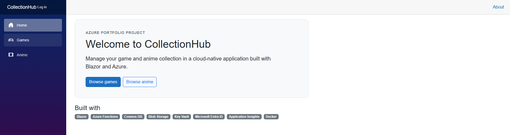
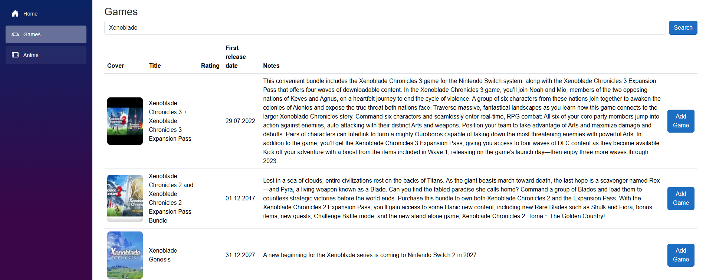
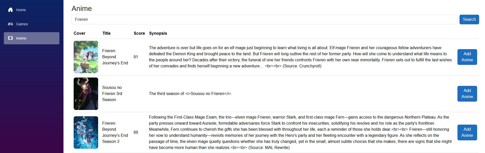
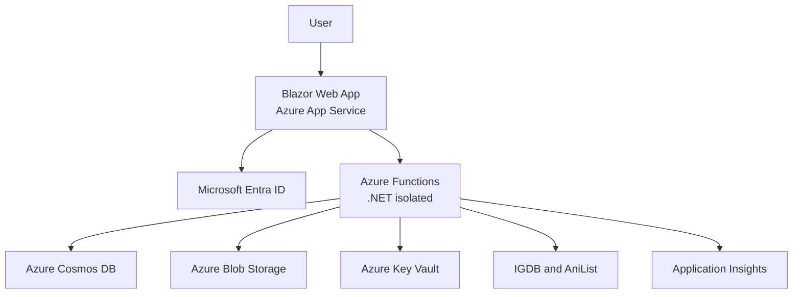

# CollectionHub

A cloud-native ASP.NET Core application for managing game backlogs
and anime collections, built with Blazor and Azure.

[](https://github.com/Mathoelz/CollectionHub/actions/workflows/ci.yml)
[](https://github.com/Mathoelz/CollectionHub/actions/workflows/deploy.yml)

## Overview

CollectionHub is a portfolio and learning project focused on practical
Azure cloud development with C#.

Users can browse game and anime collections, search external media
databases, add titles, track their status, and maintain personal
ratings and notes.

The application runs locally, with Docker Compose, and in Azure.

## Screenshots

### Home



### Game Collection



### Anime Search and Collection



## Features

- Game and anime collection management
- Create, read, update and delete operations
- IGDB game search
- AniList anime search through its GraphQL API
- Automatic cover caching in Azure Blob Storage
- Personal status, rating and notes
- Microsoft Entra ID login and logout
- Token-protected write operations
- Responsive Blazor user interface
- Loading, empty, validation and error states
- Protection against duplicate submissions
- Retry handling for transient API failures
- Automated CI/CD with GitHub Actions
- Centralized monitoring with Application Insights

## Technology Stack

### Frontend

- ASP.NET Core Blazor Web App
- .NET 10
- Bootstrap
- Microsoft Identity Web

### Backend

- Azure Functions
- .NET 8 isolated worker
- HTTP triggers
- Dependency injection
- Structured logging with `ILogger`

### Data and Storage

- Azure Cosmos DB for game and anime documents
- Azure Blob Storage for cached cover images
- A shared Cosmos DB container differentiated by `mediaType`

### External APIs

- IGDB for game metadata
- AniList GraphQL API for anime metadata

### Security

- Microsoft Entra ID
- OAuth 2.0 access tokens
- Custom API scope for the Azure Functions backend
- Azure Key Vault
- Managed identities
- Azure role-based access control
- GitHub OpenID Connect for deployments

## Azure Architecture



The Blazor application runs on Azure App Service. It communicates with
the Azure Functions backend through HTTP endpoints.

Microsoft Entra ID authenticates users. The frontend acquires an access
token for the Functions API and attaches it to protected requests.

The Functions backend stores media documents in Cosmos DB and caches
external cover images in Blob Storage. Secrets are retrieved from
Azure Key Vault through managed identity.

## Authentication and Authorization

Collection data can be viewed without signing in. Operations that
modify the collection require an authenticated user.

Protected operations include:

- adding games and anime
- editing collection entries
- deleting collection entries
- retrieving and caching protected game covers

The backend validates bearer tokens and the configured Functions API
scope before processing write requests.

Secrets and access tokens are never stored in the repository.

## Resilience

CollectionHub retries temporary API failures with incremental delays.

Retries are limited to:

- network failures without an HTTP status code
- `408 Request Timeout`
- `429 Too Many Requests`
- `5xx` server errors

Client errors such as `400`, `401`, `403` and `404` are not retried.

Create operations are sent only once because HTTP POST requests are
not inherently idempotent.

The IGDB integration tracks the Twitch access-token expiration time
and refreshes the token before it expires.

## Logging and Monitoring

CollectionHub uses Azure Application Insights and a connected
Log Analytics workspace to monitor the Azure Functions backend.

The monitoring implementation includes:

- automatic HTTP request and dependency tracking
- automatic exception telemetry
- structured application logs using `ILogger`
- request, trace, dependency and exception correlation through
  Application Insights operation IDs
- telemetry sampling to control ingestion volume
- filtered framework logs to reduce unnecessary telemetry
- structured CRUD logs containing media type and media ID
- Blob Storage cover-cache hit and miss telemetry
- reusable KQL queries for:
  - endpoint health and success rates
  - request volume and response times
  - failed requests
  - exceptions and failed dependencies
  - cover-cache hit rates

Sensitive values such as access tokens, secrets, connection strings
and complete request payloads are not logged.

## CI/CD

CollectionHub uses GitHub Actions for continuous integration and
continuous deployment.

### Continuous Integration

The CI workflow runs automatically for pushes to `main` and pull
requests targeting `main`.

It performs the following checks:

- restores and builds the Blazor web application in Release mode
- restores and builds the .NET isolated Azure Functions
- builds the Blazor Docker image
- builds the Azure Functions Docker image
- prevents deployment when a build or container validation fails

The Docker images verify that the application remains reproducibly
containerized. They are not pushed to a container registry because
the Azure production environment uses code-based deployments.

### Continuous Deployment

After a successful CI workflow on the `main` branch, the CD workflow:

1. checks out the exact commit previously validated by CI
2. authenticates to Azure using GitHub OpenID Connect
3. publishes and deploys the Azure Functions backend
4. publishes and deploys the Blazor frontend to Azure App Service

Pull requests are validated by CI but are never deployed.

The CD workflow can also be started manually through GitHub Actions.

### Deployment Security

GitHub does not store an Azure password, client secret or publish
profile.

A user-assigned managed identity and federated GitHub credential are
used to obtain short-lived Azure tokens through OpenID Connect.

The deployment identity follows the principle of least privilege and
has `Website Contributor` access only to the CollectionHub App Service
and Azure Function App.

## Local Development

Required tools:

- .NET 10 SDK
- Azure Functions Core Tools
- Docker with Docker Compose
- an Azure subscription for the connected cloud resources

The local configuration is supplied through ignored configuration
files and environment variables. Actual secrets must never be committed.

Example environment-variable names are documented in `.env.example`.

### Build

```bash
dotnet build CollectionHub_Main/CollectionHub/CollectionHub.csproj
dotnet build CollectionHub_AzureFunc/AzureCollecionHub/AzureCollecionHub/CollectionHub.Functions.csproj
```

### Docker Compose

Create a local `.env` file from `.env.example`, provide the required
configuration, and start both applications:

```bash
docker compose up --build
```

The Blazor container communicates with the Functions container through
the internal Docker Compose network.

## Project Structure

```text
CollectionHub_Main/       Blazor web application
CollectionHub_AzureFunc/  Azure Functions backend
CollectionHub_Shared/     Shared DTOs and enums
.github/workflows/        CI and CD workflows
compose.yaml              Local multi-container configuration
```

## Project Status

CollectionHub is feature-complete. The application is deployed to
Azure and supports local, Docker-based and cloud execution.